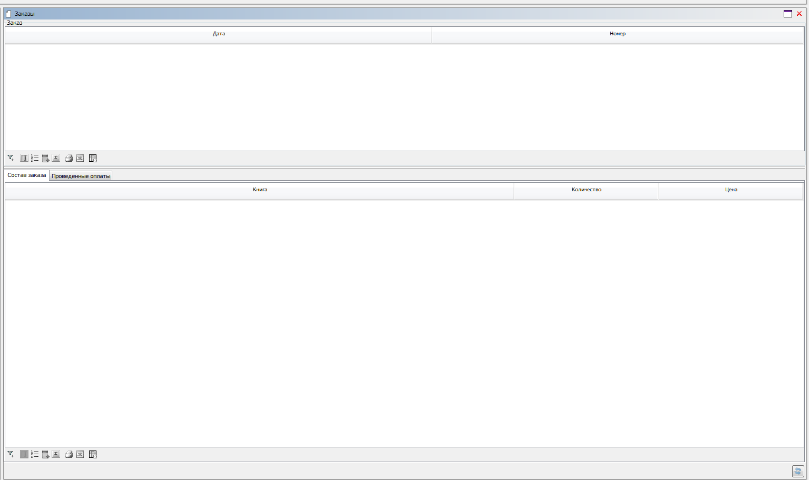

## Example 1

### Condition

We have a form with the list of orders, where each order is associated with a list of books and its posted payments.

```lsf
CLASS Book 'Book';
name 'Name' = DATA ISTRING[100] (Book);

CLASS Order 'Order';
date 'Date' = DATA DATE (Order);
number 'Number' = DATA INTEGER (Order);

CLASS OrderDetail 'Order line';
order 'Order' = DATA Order (OrderDetail) NONULL DELETE;

book 'Book' = DATA Book (OrderDetail) NONULL;
nameBook 'Book' (OrderDetail d) = name(book(d));

quantity 'Quantity' = DATA INTEGER (OrderDetail);
price 'Price' = DATA NUMERIC[14,2] (OrderDetail);

CLASS Payment 'Payment';
order 'Order' = DATA Order (Payment) NONULL DELETE;

date 'Date' = DATA DATE (Payment);
sum 'Amount' = DATA NUMERIC[14,2] (Payment);

FORM orders 'Orders'
    OBJECTS o = Order
    PROPERTIES(o) READONLY date, number

    OBJECTS d = OrderDetail
    PROPERTIES(d) READONLY nameBook, quantity, price
    FILTERS order(d) == o

    OBJECTS p = Payment
    PROPERTIES(p) READONLY date, sum
    FILTERS order(p) == o
;

NAVIGATOR {
    NEW orders;
}
```

We need to customize the design of the form, so that the lines and payments can be displayed on dedicated tabs which are separated from the list of orders using a vertical splitter.

### Solution

```lsf
DESIGN orders {
    // adding a new container to the very beginning of the form
    NEW orderList FIRST {
        fill = 1; // marking that this container should "stretch" in the upper container
        type = SPLITV; // vertical splitter - that is, there can only be 2 children
        MOVE BOX(o); // the first container will be the list of orders
        NEW orderDetails {
            fill = 2; // Specifying that the specification will take up 2 times more space than the o.box container (for all such containers fill, by default, is 1)
            type = TABBED; // the container will be a tabbed panel
            MOVE BOX(d) { // the first tab will be a list of rows with books
                caption = 'Order content';
            }
            MOVE BOX(p) { // the second tab will be the list of payments
                caption = 'Payments made';
            }
        }
    }
}
```

The form will look like this:



## Example 2

### Condition

Similar to Example 1, except we have added filters by date and customer to the form.

```lsf
CLASS Customer 'Customer';
name 'Name' = DATA ISTRING[100] (Customer);

customer 'Customer' = DATA Customer (Order);
nameCustomer 'Customer' (Order o) = name(customer(o));

filterCustomer = DATA LOCAL Customer ();
nameFilterCustomer 'Customer' = name(filterCustomer());

EXTEND FORM orders
    PROPERTIES() nameFilterCustomer

    OBJECTS dates = (dateFrom = DATE, dateTo = DATE) BEFORE o PANEL
    PROPERTIES df = VALUE(dateFrom), dt = VALUE(dateTo)

    PROPERTIES(o) READONLY nameCustomer
    FILTERS date(o) >= dateFrom, date(o) <= dateTo,
            customer(o) == filterCustomer() OR NOT filterCustomer()
;
```

We need to add filtering elements to the design of the previously created form.

### Solution

```lsf
DESIGN orders {
    orderList {
        NEW orderHeader FIRST { // creating a new container and adding the first component to the vertical splitter
            fill = 1; // it is necessary to make it "stretched" inside the orderList, as it will have a list of orders
            // by default, the type of the new container is CONTAINERV, that is, all the components in it are arranged from top to bottom
            NEW filters { // creating a container in which all the components that are responsible for filtering will be placed
                caption = 'Filters';
                type = CONTAINERH; // making it horizontal so that all components go from left to right
                MOVE PROPERTY(df) {
                    caption = 'Date from';
                }
                MOVE PROPERTY(dt) {
                    caption = 'Date to';
                }
                MOVE PROPERTY(nameFilterCustomer());
            }
            MOVE BOX(o); // moving the container with the order list to it, since there should be exactly two components in the splitter
        }
    }
}
```

Result:


